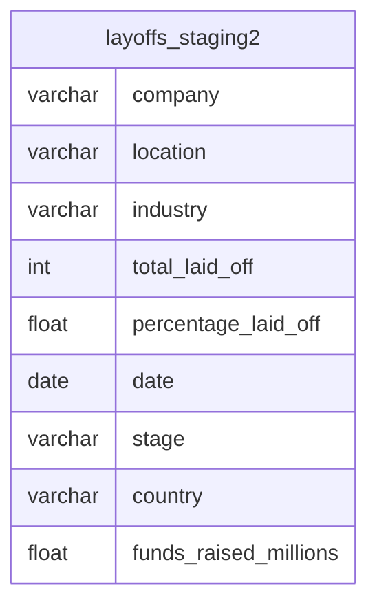

# World Layoffs – SQL Workforce Analytics (2020–2023)
Data Cleaning • Workforce Trends • Economic Insights • Advanced SQL

## Overview
SQL-based exploration of global layoff events spanning 2020–2023.  
This project demonstrates the analytical workflow expected of a mid- to senior-level data analyst: rigorous data cleaning with window functions, date and text standard standardization, workforce trend analysis, and modular SQL structuring for technical evaluation.

The cleaned dataset contains approximately 2,300 verified layoff events across industries, funding stages, and regions.

---

## Data Model (Single Table)

| Table              | Key Fields                                                                                        | Notes                               |
|--------------------|---------------------------------------------------------------------------------------------------|-------------------------------------|
| layoffs_staging2   | company, industry, total_laid_off, percentage_laid_off, date, stage, country, funds_raised_millions | Flat, denormalized economic dataset |

### ERD


---

## Dataset Summary
- 2,361 raw rows → approximately 2,300 cleaned rows  
- 9 fields  
- Time range: March 2020 – March 2023  
- Includes layoffs from startups, growth-stage companies, and global firms

---

## Project Structure
```
world-layoffs/
├── sql/
│   ├── 01_schema_and_staging.sql       -- raw → staging setup
│   ├── 02_cleaning.sql                 -- deduplication, standardization, date fixes
│   ├── 03_analysis.sql                 -- core workforce insights
│   ├── 04_sql_skills_showcase.sql      -- window functions, CASE, subqueries
├── data/
└── README.md
```

---

## Key Deliverables
- Duplicate detection and removal using ROW_NUMBER() with CTEs  
- Conversion of text dates into standardized SQL DATE format  
- Normalization of industry and country fields  
- Self-join logic to recover missing industry values  
- Identification of full workforce reductions (percentage_laid_off = 1.0)  
- Trend analysis by industry, geography, and time  
- Advanced SQL patterns (window functions, ranking, running totals)

---

## Business Insights
1. Layoffs were broad-based, with the highest counts in Finance, Retail, Healthcare, Transportation, and Marketing; Tech-adjacent sectors such as Consumer and Crypto were also significant.  
2. Layoff activity peaked in early 2023, indicating a global restructuring period.  
3. Full workforce reductions occurred, with 116 events showing 100 percent layoffs.  
4. Large funding amounts did not prevent layoffs; several well-capitalized firms still downsized.  
5. Layoffs were globally distributed, led by the United States, India, Canada, Brazil, and the United Kingdom.

---

## Highlight Query (Analytical Pattern)
Rolling monthly layoffs with cumulative totals:

```sql
SELECT 
    DATE_FORMAT(date, '%Y-%m') AS month,
    SUM(total_laid_off) AS monthly_layoffs,
    SUM(SUM(total_laid_off)) OVER (
        ORDER BY DATE_FORMAT(date, '%Y-%m')
    ) AS running_total
FROM layoffs_staging2
WHERE date IS NOT NULL
GROUP BY month
ORDER BY month;
```

---

## How to Review
Open the sql/ directory and review scripts in order.  
Execution is optional – each file is self-contained and written for technical assessment.

---

## Skills Demonstrated
- End-to-end SQL data cleaning  
- Window functions (ROW_NUMBER, RANK, running totals)  
- Real-world data standardization and validation  
- Workforce and economic trend analysis  
- Modular SQL code design  
- Senior-level documentation and analytical communication

---
